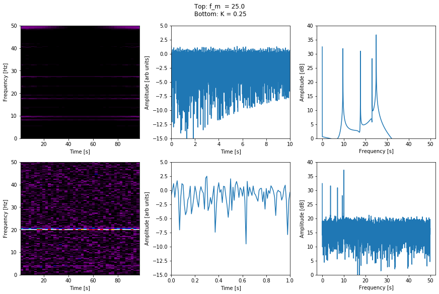

# matplotlib_examples
Some examples of plotting with matplotlib.

## jakes_animation.ipynb
This code simulates Jakes's method for Rayleigh fading, something common in wireless communication systems. An image of the plot is below, and the jakes_animation_001.html file contains a ready made animation of the process.

## Open the binder link below to try the code interactively.

